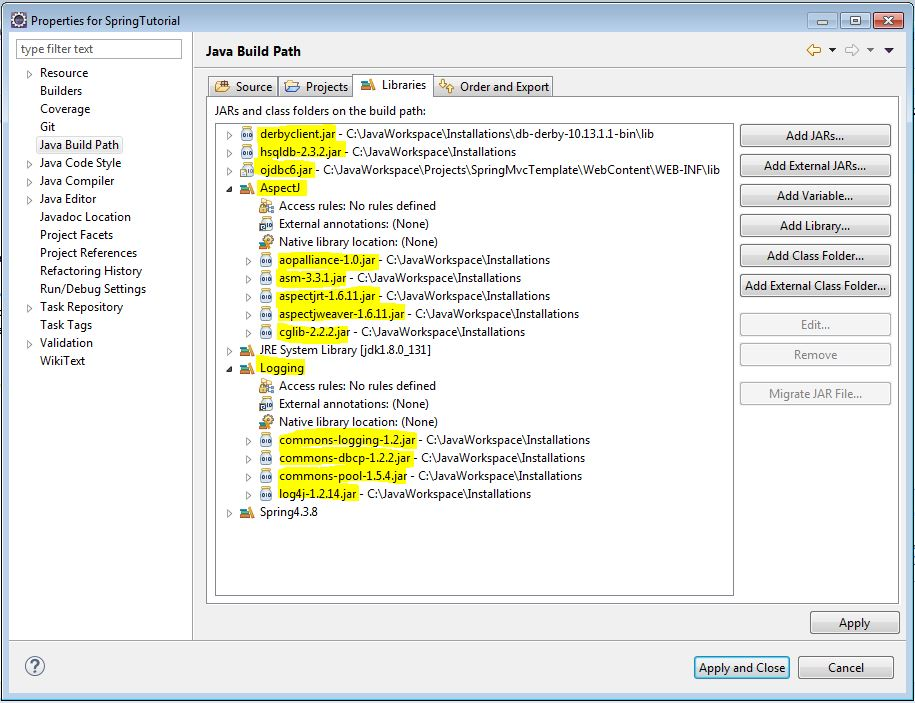
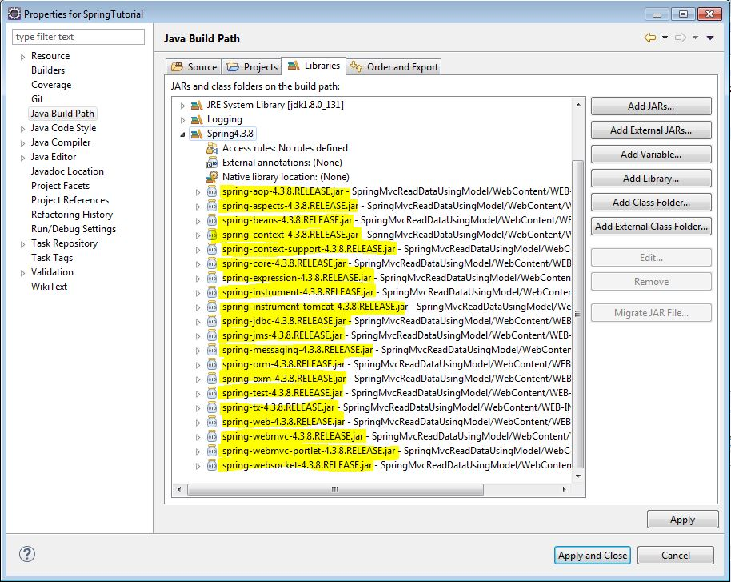

# SpringTutorial

This tutorial is based on Spring framework 4.3.8 version.

To make SpringTutorial work Add following jars for Logging, AspectJ, Jdk1.8 library, Db drivers in Java Build Path of SpringTutorial project:

Create a Spring4.3.8 User library and add following Spring jars in Java Build Path of SpringTutorial project:

